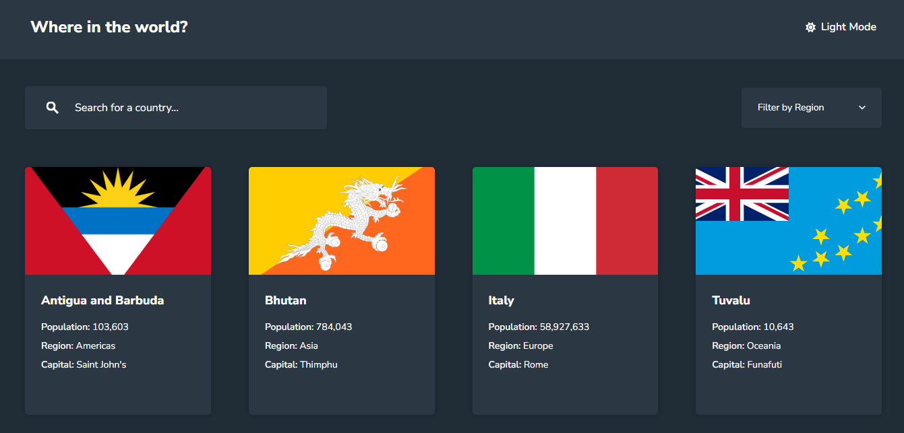

# 🌍 REST Countries API

<div align="center">




[Live Demo](https://countries-searchapp.netlify.app/) | [Frontend Mentor Solution](https://www.frontendmentor.io/solutions/rest-countries-api-with-color-theme-switch-1qx20QBsuf)

</div>

## 📖 Overview

This is a solution to the **REST Countries API with color theme switcher** challenge on Frontend Mentor. The application pulls data from the [REST Countries API](https://restcountries.com/) to display comprehensive country data, featuring search, region filtering, and a detailed view for each nation.

### ✨ Features

- 🌑 **Dark/Light Mode**: Automatic theme detection with persistent settings.
- 🔍 **Real-time Search**: Instant filtering by country name.
- 📂 **Region Filter**: Dropdown to filter countries by continent.
- ⚡ **Optimized Performance**: Lazy loading images and efficient state management.
- 📱 **Mobile-First**: Fully responsive layout built with Tailwind CSS.

## 🚀 Getting Started

Follow these steps to run the project locally.

### Prerequisites

- Node.js (v18+ recommended)
- npm or yarn

### Installation

1. **Clone the repository**

   ```bash
   git clone https://github.com/yourusername/rest-countries-api.git
   cd rest-countries-api
   ```

2. **Install dependencies**

   ```bash
   npm install
   ```

3. **Start the development server**

   ```bash
   npm run dev
   ```

## 🏗️ Project Structure

```bash
src/
├── components/       # UI components (CountryCard, SearchBar, ThemeProvider)
├── hooks/            # Custom hooks (useFetch)
├── pages/            # Page views (HomePage, CountryDetails)
└── App.jsx           # Main router configuration
```

## 💡 Lessons Learned

This project was a deep dive into React patterns and data handling.

- **Custom Hooks & Race Conditions**: Abstracted fetching logic into `useFetch`, utilizing cleanup functions to prevent updates on unmounted components.
- **Derived State**: Implemented filtering using derived state rather than redundant state variables, ensuring a single source of truth.
- **Component Composition**: Built modular components like `<BorderCountries />` with internal "rail guards" to safely handle missing API data.
- **Tailwind Dark Mode**: Leveraged React Context to toggle the `.dark` class on the HTML root, enabling seamless Tailwind dark mode support.

## 👤 Author

- Frontend Mentor - [@gustavo2023](https://www.frontendmentor.io/profile/gustavo2023)
